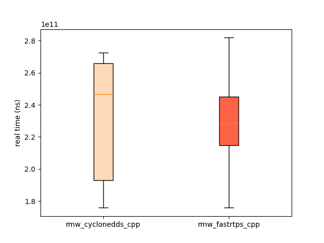

## Run All Benchmarks
Before running the following benchmarks, please read and apply the instructions outlined in the [How To Install](how_to_install.md) section for providing the necessary requirements.

To run all benchmarks, just select your middleware implementation and go ahead with `run_all_benchmarks.sh` bash script. This command initially will run the script you chose. In this example, it's used the default config scripts which the necessary middleware configuration is applied. This property serves the functionality for the users to apply some custom configurations freely.

```shell
# go to workspace this repository is built
cd ws
source /opt/ros/rolling/setup.sh
source install/setup.sh
# go to moveit_middleware_benchmark package's directory
cd src/moveit_middleware_benchmark
# conduct all benchmarks
sh src/moveit_middleware_benchmark/scripts/run_all_benchmarks.sh -i ./src/moveit_middleware_benchmark/middleware_configurations/rmw_cyclonedds/config.sh -d /benchmark_results
```

Let's explain all operations at `run_all_benchmarks.sh`.

#### selection of initial script
```
-i ./src/moveit_middleware_benchmark/middleware_configurations/rmw_cyclonedds/config.sh
```

This argument is for selecting the initial scripts to be run. These initial scripts are used for configuring middleware-specific settings for improved performance. For example, you can use the initial script to configure TCP settings for rmw_zenoh like below.

```shell
echo "The configurations for rmw_zenoh_cpp is started!"
export RMW_IMPLEMENTATION=rmw_zenoh_cpp
sudo sysctl -w "net.ipv4.tcp_rmem=4096 4096 4096"
sudo sysctl -w "net.ipv4.tcp_wmem=4096 4096 4096"
sudo sysctl -w "net.ipv4.tcp_mem=4096 4096 4096"
echo "The configurations for rmw_zenoh_cpp is finished!"
```

#### directory selection to save benchmark results
```
-d /benchmark_results
```

This argument indicates where the benchmark results are saved. For scenario_perception_benchmark and scenario_basic_service_client, the results of these scenarios are written in the shape of the below directory tree. It should be added that `run_all_benchmarks.sh` script uses json format to save the benchmark results.

```
benchmark_results/
├── scenario_basic_service_client
│   ├── rmw_cyclonedds_cpp.json
│   ├── rmw_fastrtps_cpp.json
│   └── rmw_zenoh_cpp.json
└── scenario_perception_pipeline
    ├── rmw_cyclonedds_cpp.json
    ├── rmw_fastrtps_cpp.json
    └── rmw_zenoh_cpp.json
```

## Plot Visualization of Benchmark Results

After running `run_all_benchmarks.sh`, you can also visualize the box plots of benchmark results. Suppose that you have some benchmark results stored in below directory and the directory named `benchmark_results` is located in `ws` directory which this repository is built.


```
benchmark_results/
├── scenario_basic_service_client
│   ├── rmw_cyclonedds_cpp.json
│   ├── rmw_fastrtps_cpp.json
│   └── rmw_zenoh_cpp.json
└── scenario_perception_pipeline
    ├── rmw_cyclonedds_cpp.json
    ├── rmw_fastrtps_cpp.json
    └── rmw_zenoh_cpp.json
```

Just give the directory of benchmark results as argument and then visualize the benchmark results in plot.
```shell
cd ws
python3 src/moveit_middleware_benchmark/scripts/box_plot_visualizer.py benchmark_results

```

**NOTE THAT THE BELOW PICTURE DOESN'T PRESENT REAL RESULTS. IT'S JUST FOR SHOWCASE**



## Scenarios

### [Perception Pipeline Benchmark](scenarios/perception_pipeline_benchmark.md)

This benchmark measures the elapsed time by which the determined path is sent for the robot to follow. This benchmark calculates `elapsed time`, `success_number` and `failure_number`. `elapsed_time` is used for measuring how much time the pipeline takes. `success_number` is used for presenting successfully plannings and `failure_number` is used for presenting failed plannings.

Firstly, `node` and `move_group_interface`in SetUp are created before each benchmark. `poses` inside `nav_msgs/msg/Path` is sent one by one to plan trajectory for robot. If planning is failed, only `failure_rate` is increased. If planning is successful, the trajectory_plan which move_group_server plan is sent via `move_group_interface` to start the execution of this planned trajectory. Then `success_number` is increased.

For instance, the selected test_case includes 20 goal poses. These 20 goals is sent one by one to `move_group_server`. If the 5 goal poses out of 20 goal poses are failed, `success_number` equals 15 and `failure_number` equals 5. `success_number` and `failure_number` is important to observe the middlewares' behaviours.

### [Basic Service Client Works Benchmark](scenarios/basic_service_client_benchmark.md)

This benchmark measures the total elapsed time based on the time interval between sending the request by the client to the server and getting the response of server. This benchmark utilizes the [ros2/demos](https://github.com/ros2/demos) packages' [example server](https://github.com/ros2/demos/blob/rolling/demo_nodes_cpp/src/services/add_two_ints_server.cpp).

In this benchmark scenario, the benchmarker node only has client interface. The necessary server for this client is run in [the launch file of this benchmark scenario](../launch/scenario_basic_service_client_benchmark.launch.py). Client sends a request to server and waits for the response from server. Client sends second request to server once the client receives response of first request from client. This actions are repeated `sending_request_number` times. You can configure this `sending_request_number` parameter in [this scenario's launch file]((../launch/scenario_basic_service_client_benchmark.launch.py)).

### [Basic Topic Subscription Publishing Benchmark](scenarios/basic_topic_sub_pub.md)

This benchmark aims to measure the ROS message latency by sending some ROS message which has array section and timestamp section and receiving this message in topic listener side. Firstly, in the topic publisher side, message is created using given `pose_array_size`, `bwnchmarked_topic_name` and `benchmarked_topic_hz`. The topic listener subscribes the topic named `benchmarked_topic_name` to listen this ROS message is published. When message is received from topic publisher side, It's found the message latency by subtracting message timestamp (indicates the time message is published) inside the message callback from current time (indicates the time message is received). Finally, this message latencies are added to total elapsed time. When message number handled achieved `max_received_message_number`, this total elapsed time is used to compare middleware effects in scenario of topic subscription-publishing.
